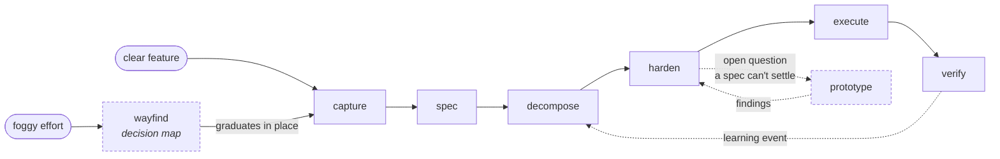

# cogwright

**A marketplace of systems for running [Claude Code](https://claude.com/claude-code) as an agentic operating layer** — planning chains, project onboarding, memory, dispatch — built from one heavily-used personal setup and packaged as systems that declare their relations explicitly.

The thesis: agentic coding gets reliable when the *process* is engineered — goals with verification built in, guardrails enforced outside the model's context, memory that persists, and honest status everywhere. Each plugin here is one of those process systems, extracted and hardened.

## Quickstart

```
/plugin marketplace add Truncuso/cogwright
/plugin install goalforge@cogwright
/plugin install xquik-x-data@cogwright
```

Most systems install standalone: relations declared as `recommends` degrade gracefully — a missing companion produces a warning, not a failure. A declared `requires` edge is hard: goalforge hard-requires the interview plugin. This marketplace names the dependency's source repository; the version is resolved at install time from `interview--v<version>` git tags on that repository, matched against the declared range, and the matched tag's `ref`/`sha` override the marketplace entry's pin.

## Installing (contributor vs consumer)

`scripts/install.sh` covers both install modes:

```
scripts/install.sh --mode consumer      # prints the marketplace commands above + runs `claude plugin validate`
scripts/install.sh --mode contributor   # dev mode: symlink your skills dir at this checkout
scripts/install.sh --self-test          # fixture-sandbox self-test (never touches your real $HOME)
```

**Contributor (dev) mode** replaces `~/dotfiles/claude/skills/goalforge` with a
per-machine symlink pointing at `packages/goalforge` in *this* cogwright
checkout, so every future goalforge edit lands in the working tree and `git push`
keeps GitHub current. The swap is a strict, verified transaction:

- **Precondition — a cogwright checkout must be present.** The link target
  (`packages/goalforge`) has to resolve to a real package with a `SKILL.md`;
  contributor mode refuses if it does not.
- **Refuses to clobber drift.** If the existing real dir has uncommitted
  *tracked* changes versus the package it refuses rather than overwrite. Drift is
  measured on tracked content only (gitignored `__pycache__` / `evals/workspace`
  transients are ignored), never a raw `diff -r`.
- **Idempotent.** Re-running on a correct install is a no-op (exit 0). A
  wrong-target or dangling symlink is repaired; a dirty real dir is refused with
  a clear message.
- **Rollback is git.** The dotfiles dir removal is one reversible commit
  (`git revert` restores every tracked file). No in-repo backup dir is created.

**Dangling-link semantics / the symlink is never git-tracked.** dotfiles commits
a `.gitignore` entry for `skills/goalforge` and the installer recreates the link
per machine, so machines that clone dotfiles WITHOUT cogwright get no dangling
link. The cost: **a dotfiles clone alone no longer carries goalforge** — run
`scripts/install.sh --mode contributor` from a cogwright checkout (or install the
plugin via the marketplace) before goalforge is available on a new machine.

## Repository layout

Two trees hold each system, and only one of them is authored by hand:

| Path | Role |
|---|---|
| `packages/<name>/` | **Source of truth.** The nested v2 package: a public parent `SKILL.md` owning private child skills, plus shared `references/`, `scripts/`, and `evals/`. Edit here. |
| `plugins/<name>/` | **Generated installable artifact.** The flat, plugin-discoverable shape Claude Code loads (`skills/<child>/`, root-level `scripts/` and `references/`). Do not hand-edit. |
| `scripts/`, `.claude-plugin/` | Generator + marketplace manifest. `.claude-plugin/marketplace.json` points consumers at `plugins/<name>/`. |

The generator (`scripts/goalforge-generate.sh`) is a pure, offline file
transformation — no LLM calls, no network, byte-stable and idempotent:

```
scripts/goalforge-generate.sh            # regenerate plugins/goalforge in place
scripts/goalforge-generate.sh --check    # exit 2 if the tree drifted from the package
```

`--check` is wired into pre-commit, so a package edit that was never regenerated
cannot land. **The exception:** `hooks/` and `.vendored-allowlist.txt` inside
`plugins/<name>/` are plugin-packaging concerns with no package counterpart —
they are hand-authored there and the generator preserves them, never
regenerating or deleting them.

Flattening costs privacy: a package's private children become top-level plugin
skills. The generator compensates by prefixing every child description with the
fixed marker `goalforge-internal — use entry commands; do not auto-trigger`
(the parent front door is untouched, and a `privacy-marker` lint section
asserts both). This is **soft** suppression — a description steers selection,
it does not gate it, so a child may still trigger on a strongly matching
request. Entry stays through the commands and the front door.

Full package→plugin pipeline, relations map, and the daily workflow:
[docs/ARCHITECTURE.md](docs/ARCHITECTURE.md).

## Catalog

| System | Status | What it is |
|---|---|---|
| **goalforge** | **shipped** (v3.0.0) | Goal-and-verification-driven development chain: capture → spec → decompose → harden → execute → verify. Work packages are *goal objects* — outcome, verification strategy, constraints, boundaries — so "done" is machine-decidable wherever possible. 18 skills — 15 chain stages plus `wayfind`, `prototype`, and `brief`. |
| **interview** | **shipped** (v1.0.3) | Interview engine plugin (source repo: [elicitforge](https://github.com/Truncuso/elicitforge)) — grills plans, specs, and ideas before they're acted on, via typed presets (`/interview` with `preset: <name>`) or a bare grill (`/grill`); goalforge's harden stage delegates to it. |
| **xquik-x-data** | **shipped** (v0.1.0) | Source-backed Xquik REST API and remote MCP workflow guidance with read-only defaults and explicit approval gates. |
| **project-onboard** | in development | One front door that sets up a new *or* existing project with the full agentic surface: git + guardrail hooks, intent interview, memory/doc spine, retrieval indexes — interactive for new projects, plan-only auto mode for existing ones. |
| **agent-dispatch** | planned (next) | Route work to the right model/provider (Anthropic, DeepSeek, Z.AI, Ollama, OpenRouter) with explicit model+effort per dispatch. |
| **agentic-memory** | planned *(working name — final name pending)* | File-backed typed memory vault with session injection, semantic recall, and distillation. |
| **idea system** | planned | Capture → refine → review → promote pipeline for ideas, with provenance carried into promoted features. |
| **command-center** | planned | A host application with an **extension point**: other systems contribute pluggable status panels (goalforge WP status, memory browser, dispatch monitor). Under design. |

**Honest-status legend:** *shipped* = installable now, evals pass; *in development* = spec public, code landing; *planned* = design exists, nothing installable yet. Nothing here is labelled further along than it is.

### Inside goalforge

The chain is fifteen stage skills, alongside three skills that are **not**
stages (`wayfind`, `prototype`, `brief`) — two of them worth naming here,
because they handle the work *before* a spec is writable, and the work a spec
cannot answer on paper:

| Sub-capability | Status | What it is |
|---|---|---|
| **wayfind** (v0.3.0) | shipped | Pre-spec on-ramp for a foggy, multi-session effort: builds a decision map (`map.md` pointer-index + one-decision-per-ticket files), drives a frontier-computed work loop across sessions, and graduates in place into `goalforge-capture` once the fog clears. Skipped entirely when a feature is already clear. |
| **prototype** (v0.3.0) | shipped | Declared spike register: one design question, explicit success criteria, throwaway code in a logic / UI / perf branch. The findings doc is the survivor; the code is deleted or absorbed through review at production rigor — never merged in spike form. |

`brief` is the third non-stage skill: it authors the task briefs that
`goalforge-execute` consumes.



Human sign-off gates sit at draft → ready (feature) and hardened → ready (WP); everything from
`execute` onward runs automated against the goal object's declared verification
strategy.

## Adjacent systems (not plugins)

Not everything in the suite is a Claude Code plugin, and this marketplace does not pretend otherwise:

- **tangram** — a TypeScript/npm monorepo for rendering and publishing structured content (interactive lessons and other typed documents). Currently **under re-specification**; it lives in its own repository and will relate to marketplace systems via a typed content-IR contract (`emits-to`), not as a plugin.
- **command-center** — will ship as its own application (host-with-panels), registered here for discovery; panels from marketplace systems plug into it.

## How systems relate

Systems declare relations in a `relations.yaml` beside their `plugin.json`, with five kinds: `requires` (hard), `recommends` (soft — degrade, never block), `vendors` (copied files, gated by a committed allowlist), `provides-slot` / `fills-slot` (extension points, e.g. command-center panels), and `emits-to` (typed artifacts crossing ecosystems). The marketplace renders the resulting map. A system with only `recommends` edges installs alone; a `requires` edge is hard — goalforge hard-requires the interview plugin, resolved at install time from `{name}--v<version>` git tags on the dependency's own source repository rather than from this marketplace's pinned `ref`/`sha`.

## Authoring and contributing

Each plugin follows the same shape: `skills/` (one directory per skill, `SKILL.md` + scripts + evals), optional `commands/` and `hooks/`, a `.claude-plugin/plugin.json`, and — where content was copied in from elsewhere — a `.vendored-allowlist.txt` naming every vendored file. CI validates plugin structure on every push. Issues and PRs welcome; keep changes surgical and ship evals with new skills.

## Acknowledgements

These systems build on ideas from public creators and communities — see [ACKNOWLEDGEMENTS.md](ACKNOWLEDGEMENTS.md). Attribution is a first-class deliverable here, captured at the moment of adoption, not retrofitted.

## Maintainer & license

Christoph Unger ([Truncuso](https://github.com/Truncuso)). MIT — see [LICENSE](LICENSE).
