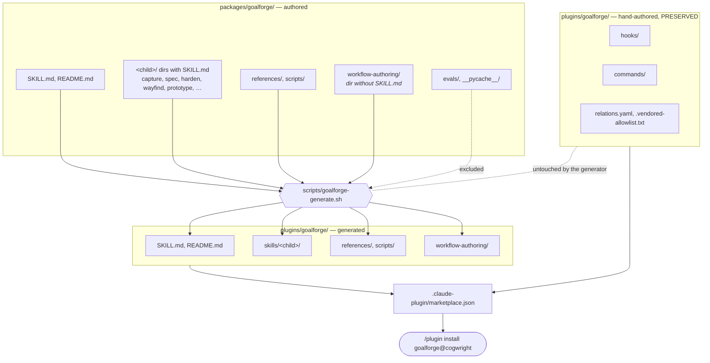
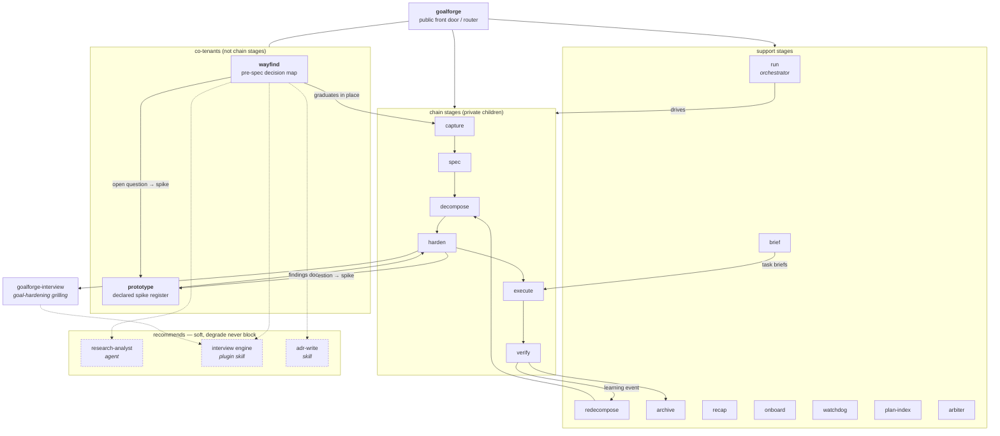

# Architecture

How the repository is built, how the goalforge skills relate to each other, and
how the whole thing is actually used day to day. Start at the
[README](../README.md) for the catalog and install instructions.

## Package → plugin build pipeline

`packages/<name>/` is authored; `plugins/<name>/` is generated. The generator is
a pure file transformation — no LLM calls, no network — so the artifact is
byte-stable and re-running it on a clean tree is a no-op.

Two rules make this safe to trust:

- **Drift gate.** `scripts/goalforge-generate.sh --check` regenerates and exits
  2 if the tree moved. Pre-commit runs it, so a package edit that was never
  regenerated cannot land, and `plugins/` can never silently diverge from its
  source.
- **Path rewriting is a pinned rule table.** Flattening `packages/<child>/` to
  `plugins/skills/<child>/` changes relative depth, so the generator rewrites
  child→root script climbs to `${CLAUDE_PLUGIN_ROOT:-<local-fallback>}/scripts`
  and `${CLAUDE_SKILL_DIR}/` prose to the plugin path. Local-only telemetry
  hooks are stripped from generated frontmatter. Cross-skill prose references
  are left verbatim rather than rewritten into paths that would not exist for a
  consumer. The full class table (i–vii) is the header comment of the generator.

## Relations map

Two kinds of edge. **Inside** the package, the public parent routes to private
nested children — discovery is one level deep, so nesting is what keeps the
children from triggering on their own. **Outside**, `relations.yaml` declares
soft `recommends` edges: a missing companion degrades to a named fallback, it
never blocks. Installing goalforge alone always works.

Declared degradations, verbatim from `plugins/goalforge/relations.yaml`:

| Missing | Used by | Degrades to |
|---|---|---|
| `research-analyst` | wayfind | dispatch a general-purpose agent with an explicit research brief |
| `interview` | wayfind, goalforge-interview | one-question-at-a-time question loop in the main session |
| `adr-write` | wayfind | skip the ADR gate; log the skipped decisions in the graduation brief |

The `/spec`, `/plan`, `/implement`, `/verify` commands are the human entry
points; each drives the chain through the `run` orchestrator rather than
invoking stage skills directly. `/wayfind` is the one entry point that sits
before the chain begins.

## How this is used daily

The chain is not run end-to-end from a standing start. Which door you enter
through depends on how much fog there is.

**A foggy effort starts at `/wayfind`.** Anything too big to spec — spanning
several sessions, with unknowns that could flip the approach — gets a decision
map under `plans/<effort>/wayfind/` before a single line of spec is written.
`map.md` is a pointer-index only; each open decision is its own ticket file, and
each session works the frontier the tickets compute rather than re-deriving
priority by hand. Research and spike outputs land in `findings/` and are linked
from the ticket they resolve. When charting surfaces no real fog, wayfind exits
early and hands the idea straight to capture — the map is a cost, and it is only
paid when the fog is real.

**Convergence graduates in place.** The effort slug becomes the feature slug, so
graduation writes `overview.md` next to the existing `wayfind/` directory rather
than moving anything. From there the normal chain runs: `/spec` (human-gated at
draft → ready), `/plan` to decompose into work packages and harden them to ready
(human-gated at hardened → ready), then `/implement` and `/verify` automated
against each work package's declared verification strategy — deterministic,
numeric, judge, or human. A clear one-session feature skips wayfind entirely and
starts at `/spec`.

**Questions a document cannot settle go to `prototype`.** During hardening, an
open question of the form "which approach wins / how should this behave / is it
fast enough" routes to a spike instead of another interview round. The spike
takes exactly one question plus explicit success criteria — it refuses a brief
that bundles two — and runs in a declared relaxed register: no tests, no
persistence, no abstraction beyond the question. What survives is the findings
doc. Spike code is deleted, or, for the logic branch only, absorbed into the
real codebase through review at full production rigor. It never merges in spike
form.

**Handoff docs bridge sessions.** A multi-session effort ends each session with
a committed handoff document rather than an in-flight context window. The next
session picks it up deterministically — claim, archive, load — and continues
from the frontier the map or the work-package statuses compute. Status lives in
frontmatter, not in a lifecycle folder structure, so "where is this" is a query
over `plans/` and never a directory the human has to keep tidy.

The recurring pattern across all of it: state is on disk in typed, greppable
files; the model reads the frontier rather than remembering it; and every
transition that is expensive to reverse has a gate a human passes through.
