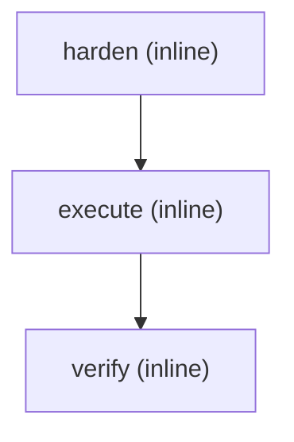

---
execution_plan:
  dispatch:
    execute: inline
    harden: inline
    verify: inline
  parallel:
  - - harden
  - - execute
  - - verify
  steps:
  - harden
  - execute
  - verify
  tiers: {}
name: captured-full-chain
provenance: fixtures/trace-events.jsonl
---

# Captured execution_plan route: captured-full-chain

Captured from a completed goalforge-chain run; loads UNMODIFIED through
`run/scripts/goalforge-plan-consumer.sh`.

Provenance: `fixtures/trace-events.jsonl`
